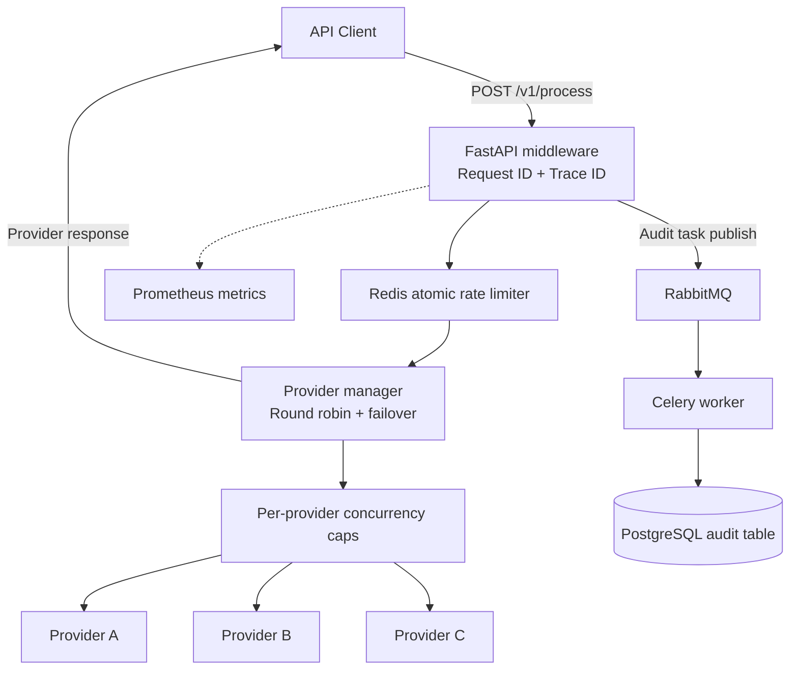

# Architecture diagram

```mermaid
flowchart TB
  Client[API Client] -->|POST /v1/process| Middleware[FastAPI middleware\nRequest ID + Trace ID]
  Middleware --> Limit[Redis atomic rate limiter]
  Limit --> Router[Provider manager\nRound robin + failover]
  Router --> Sem[Per-provider concurrency caps]
  Sem --> A[Provider A]
  Sem --> B[Provider B]
  Sem --> C[Provider C]
  Router -->|Provider response| Client
  Middleware -.-> Metrics[Prometheus metrics]
  Middleware -->|Audit task publish| Broker[RabbitMQ]
  Broker --> Worker[Celery worker]
  Worker --> DB[(PostgreSQL audit table)]
```

The provider manager enforces timeouts, bounded in-flight requests, and a circuit breaker. Audit persistence is asynchronous and eventually consistent.
